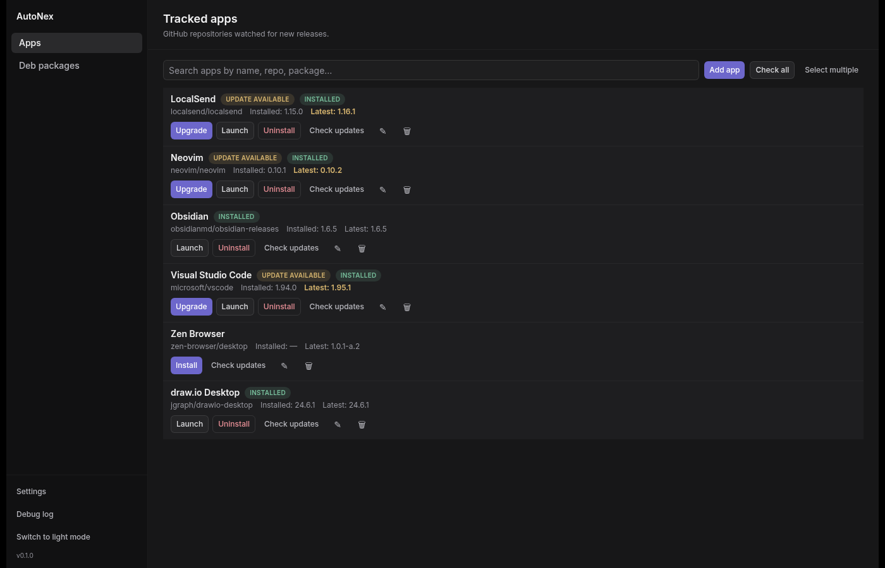
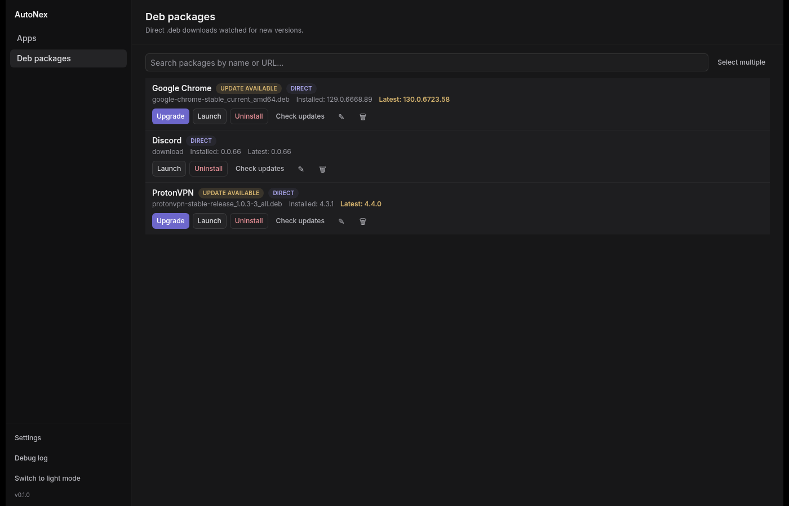
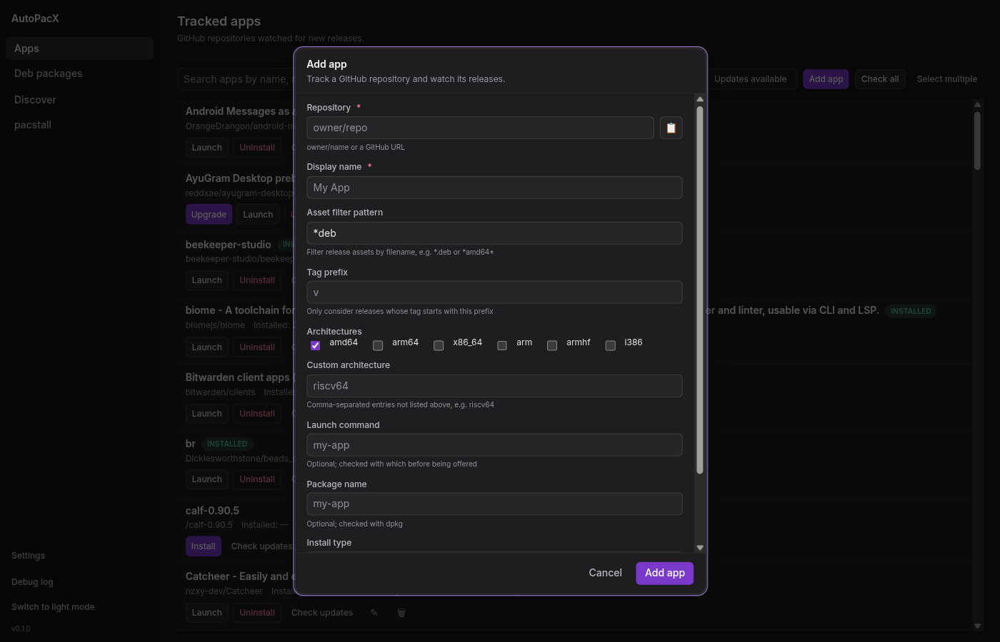
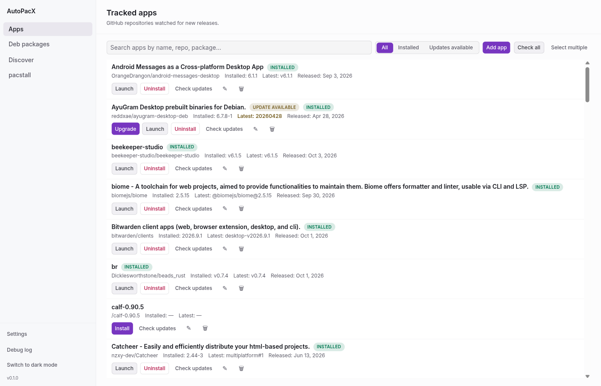

# AutoPacX

## Screenshots









A GitHub-release package manager for Linux. Desktop application built with
Electron, React 19 and TypeScript.

This directory is a clean-room TypeScript rewrite (Wave 1 — walking skeleton)
of the original Flutter application. No business logic is implemented yet; it
only boots an Electron window with a secured renderer and a React placeholder.

## Requirements

- Node.js 20+
- pnpm (enable via `corepack enable`)

## Commands

```bash
pnpm install     # install dependencies (downloads the Electron binary)
pnpm dev         # run the app in development
pnpm typecheck   # type-check the node (main/preload) and web (renderer) projects
pnpm test        # run unit tests with vitest
pnpm build       # bundle main, preload and renderer with electron-vite
pnpm package     # build a Linux AppImage with electron-builder
```

## Layout

- `src/core` — framework-free shared logic and contracts (no Electron/Node/DOM).
- `src/main` — Electron main process, IPC handlers and security policy.
- `src/preload` — sandboxed `contextBridge` bridge.
- `src/renderer` — React renderer (Tailwind CSS v4).

## Privileged operations (pkexec + polkit)

Installing a package, removing one, or writing a binary into a system directory
requires root. AutoPacX never builds a shell string and never asks `pkexec` to
run a generic interpreter or package manager. Every privileged step is an argv
array of the form
`pkexec /usr/lib/autopacx/autopacx-helper <verb> <args...>`, where the
root-owned helper (`resources/autopacx-helper`) accepts a small, validated
verb protocol (`apt-install`, `rpm-install`, `dpkg-remove`, `rpm-remove`,
`atomic-install`, `backup`, `cleanup`) and rejects any path outside the app's
own download/staging directories or a fixed install-directory allowlist. For the
GUI to show a named, readable authentication prompt, two things are needed on
the machine:

1. **A running polkit authentication agent** — e.g. `polkit-gnome`,
   `polkit-kde-agent`, or the agent shipped by the desktop environment. Without
   one, `pkexec` fails with `Error executing command as another user: No
authentication agent found`.
2. **This policy file and helper installed** — `resources/org.autopacx.policy`
   copied to `/usr/share/polkit-1/actions/org.autopacx.policy`, and
   `resources/autopacx-helper` installed root:root 0755 at
   `/usr/lib/autopacx/autopacx-helper`. The policy binds its single action to
   that one helper, so the prompt reads "Authentication is required to install
   or remove a package with AutoPacX" and no other program can be run through
   the action. Authentication is required every time (`auth_admin`, not
   `auth_admin_keep`), so approvals are never cached.

Both files are shipped inside the package (via `extraResources` in
`electron-builder.yml`) and installed by the package post-install script. To
install them by hand from a source checkout:

```bash
sudo install -m 644 resources/org.autopacx.policy \
  /usr/share/polkit-1/actions/org.autopacx.policy
sudo install -m 755 -o root -g root resources/autopacx-helper \
  /usr/lib/autopacx/autopacx-helper
```

Running the app from a source checkout without those two files is supported, but
any privileged install then fails with a clear "Privileged helper not found"
error rather than silently falling back to a generic root command.

## GitHub token

The GitHub personal access token is stored **encrypted** in `settings.json`
using Electron's `safeStorage` (backed by the OS keyring: gnome-keyring /
KWallet / Keychain / DPAPI). The renderer never receives the token —
`getSettings` returns a masked map with a `hasGithubToken` flag. If no keyring
is available, saving a token fails with a clear error instead of writing it in
plaintext. A legacy plaintext `github_token` is encrypted automatically on
startup.

## Restricted networks

`pnpm install` downloads the Electron runtime from GitHub Releases. On networks
where GitHub is unreachable, point the downloader at a mirror and, if the
connection is intercepted by a TLS proxy, trust its CA:

```bash
export ELECTRON_MIRROR=https://cdn.npmmirror.com/binaries/electron/
export NODE_EXTRA_CA_CERTS=/path/to/proxy-ca.pem   # only if a TLS proxy is in use
pnpm install
```

## License

MIT © 2024 PlebOne. See [LICENSE](./LICENSE).
